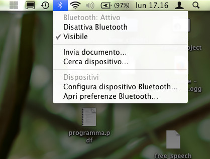
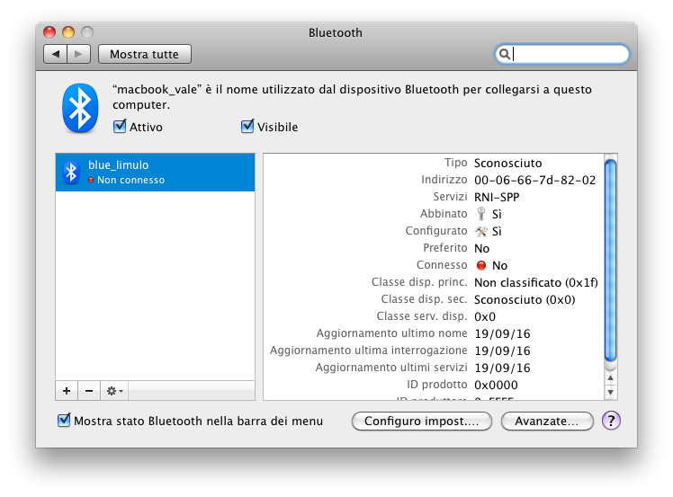
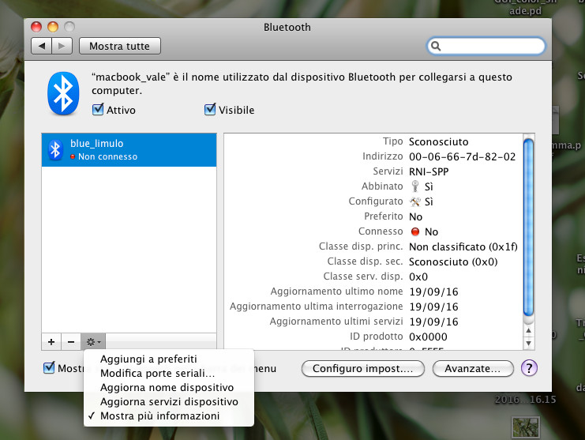
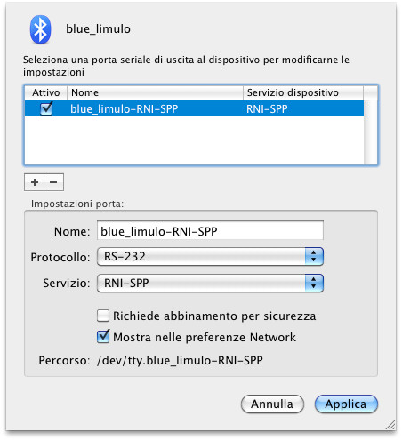

# Test Preliminare BlueTooth - 19 Sept 2016

Abbiamo connesso il modulo **BlueSmirf** alla porta _Serial1_ dell'Arduino Mega. In tale modo ci è stato possibile scrivere sulla UART (per comunicare con il computer connesso via USB) e comunque ricevere dati via bluetooth senza usare la libreria _software serial_ .

Ecco il codice:

    void setup() 
    {
        Serial.begin(115200); // Serial monitoring
        delay(1000);
        Serial1.begin(115200); //Bluethooth monitoring
        delay(1000);
    }

    void loop() 
    {
         while(Serial.available())
        {
            char c = Serial.read();
            Serial1.write(c);
            //Serial.print("\tcharacter "); Serial.print(c); Serial.println(" written!");
        }
  
        while(Serial1.available())
        {
            char c = Serial1.read();
            Serial.write(c);
        }
    }

Per testare l'effettivo funzionamento della comunicazione bluetooth ci serviva un altro dispositivo capace di ricevere ed inviare bytes con questo stesso protocollo. Abbiamo scelto di usare i nostri _macbook_ (ah, quale errore!)

Dopo ore di sperimentazione, ecco quale sembra essere la procedura corretta per far funzionare il tutto:

* sul macbook, attivare il sistema _bluetooth_ e impostare la _visibilità_;

* Alimentare Arduino e caricare lo sketch;
* accedere alla _COMMAND MODE_ del BlueSmirf usando il comando **$$$** (ricorda di usare il _no line ending_);
* fare uno scanning per individuare i dispositivi raggiungibili (comando **I** - ricorda di usare il _newline_);
* mi connetto ad uno di questi usando il comando **C,<indirizzo>**;
* esco dal _COMMAND MODE_ (non indispensabile).
* Sul macbook effettuare l'aventuale **pairing** se la connessione viene effettuata per la prima volta (inserire il **PIN: 1234**).

* accedere alle preferenze Bluetooth e, selezionato il dispositivo _bluesmirf_, impostare la porta seriale di uscita per lo stesso: 
    click sul simbolo della rotellina sotto l'elenco dei device -> _modifica porte seriali_ 

    click su _+_ per aggiungere una porta seriale -> click  su  _applica_ per rendere effettive le modifiche.

* accedere per via terminale (con **screen** - [per uscire _CTRL+A CTRL+\_] - ) o via software (con **CoolTerm** scaricabile da [qui](http://freeware.the-meiers.org/)) allo stream sulla porta seriale inviando e ricevendo dati.
* per inviare dati dalla porta seriale di Arduino, scrivere nel campo in alto e premere 'send'.
